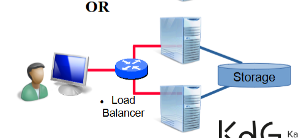

# Redundante Server
Deze repository bevat een handleiding voor een (simpele) setup van redundante webservers met een **load balancer**.

## Voorbereiding
### Setup


Gebruik makende van rsync in tegenstelling tot Shared Storage
### Tools
- **Host:** eigen laptop
- **Load Balancer:** VyOS
- **Servers:** ubuntu -> Draaien nginx of apache voor webserver
- **rsync:** Op beide servers via SSH keys (OpenSSH) kunnen ze delen met elkaar


### Installatie

**Ubuntu Server 24.04.2 LTS**: [link](https://ubuntu.com/download/server/thank-you?version=24.04.2&architecture=amd64&lts=true)
**VyOS**: [link](https://canvas.kdg.be/courses/48184/modules/items/1149495)

## Start Setup
### Installatie Ubuntu WebServer
#### VBox
Installeer de ISO met
- RAM: 1GB
- Core: 1
- Disk: 10GB
- Skip unnattended installation

#### Config
```config

-- Language

-- Keyboard

-- Type of installation
Normaal

-- Network Config
Laat zo

-- Proxy

-- Archive Mirror

-- Guided Storage config
Entire Disk
Continue

-- Profile
webserver1
webserver1
webserver1
webserver1
webserver1

-- Upgrade
Skip for now
vyos
-- Install OpenSSH Server
Vink aan

-- Featured Server Snaps
Laat zo

-- reboot

---------- setup
> export SERVER_ID=server1
> sudo apt update && sudo apt upgrade -y
> sudo apt install apache2 -y
> sudo apt install rsync -y
> sudo apt install python3 python3-pip
> sudo apt install python3-flask
> git clone https://gitlab.com/TiboKDG/netwerken2isb.git
> curl localhost -> Check of de webserver draait
```

### Installatie VyOS LoadBalancer
#### VBox
Installeer de ISO met
- RAM: 1GB
- Core: 1
- Disk: 2GB

#### Config
```
install image
volg installatie wizard
```

### Installatie Ubuntu Webserver 2

#### In VBox
Rechtermuisknop op webserver1 > Clone > Rename > Full Clone > Finish


### Link VMs
1. Instellen netwerkadapters VBox
	- Webservers
		- Ga naar settings > Network > Selecteer Adapter 1 > Enable Network Adapter
		- Bij "Attached to" kies `Internal Network`
		- Bij "Name" kies intern
		- Klik OK
	- LoadBalancer
		- Adapter 1
			- Ga naar settings > Network > Selecteer Adapter 1 > Enable Network Adapter
			- Bij "Attached to" kies `Host-Only`
			- Bij "Name" kies bestaande Host-Only adapter 
			- Klik OK
		- Adapter 2
			- Ga naar settings > Network > Selecteer Adapter 2 > Enable Network Adapter
			- Bij "Attached to" kies `Internal Network`
			- Bij "Name" kies intern
			- Klik OK
2. VMs starten
3. Configureer IP-addressen
	- Load-Balancer
```
> config
> set interfaces ethernet eth0 address 192.168.245.10/24
> set interfaces ethernet eth1 address 192.168.100.1/24
> set interfaces ethernet eth1 address 192.168.100.100/32
> commit
> save
```
- Webserver 1 -> Stel ip in in volgende file
`sudo nano /etc/netplan/*.yaml`
```yaml
network:
 version: 2
 ethernets:
   enp0s3:
     dhcp4: false
     addresses: [192.168.100.11/24]
     gateway4: 192.168.100.1
     nameservers:
	     addresses: [8.8.8.8, 1.1.1.1]
```
`sudo netplan apply`
- Webserver 2 -> Stel ip in in volgende file
`sudo nano /etc/netplan/*.yaml`
```yaml
network:
 version: 2
 ethernets:
   enp0s3:
     dhcp4: false
     addresses: [192.168.100.12/24]
     gateway4: 192.168.100.1
     nameservers:
	     addresses: [8.8.8.8, 1.1.1.1]
```
`sudo netplan apply`

## Opzetten Servers
### Aanmaken service
`sudo nano /etc/systemd/system/flaskapp.service`

```ini
[Unit]
Descriptor=Flask App Service
After=network.target

[Service]
User=<username>
WorkingDirectory=/home/<username>/netwerken2isb
ExecStart=/usr/bin/python3 app.py
Environment=SERVER_ID=server1
Restart=always

[Install]
WantedBy=multi-user.target
```
### Configure rsync
- Set up SSH key-based authentication - will allow rsync to transfer files without needing a password
```bash
ssh-keygen -t rsa
```
**Copy public key to webserver 2**
```bash
ssh-copy-id webserver2@192.168.100.12
# enter password for the webserver2 user on webserver2
# Now webserver1 can ssh into webserver 2
```
**Create rsync script on webserver 1**
```bash
~/sync_to_web2.sh
#!/bin/bash
rsync -avz /home/webserver1/netwerken2isb/shared_counter.csv webserver1@192.168.100.11:/home/webserver2/netwerken2isb/
chmod +x sync_to_web2.sh
```
### Cron job toevoegen

> sudo crontab -e
```bash
* * * * * ~/sync_to_web2.sh
```

## Load-Balancer configureren
### Backend
```vyos
> configure
> set load-balancing haproxy backend webservers server webserver1 address 192.168.100.11
> set load-balancing haproxy backend webservers server webserver1 port 5000
> set load-balancing haproxy backend webservers server webserver2 address 192.168.100.12
> set load-balancing haproxy backend webservers server webserver2 port 5000
> set load-balancing haproxy backend webservers balance round-robin
```
### Frontend
```
> set load-balancing haproxy service web-frontend backend webservers
> set load-balancing haproxy service web-frontend listen-address 192.168.100.100
> set load-balancing haproxy service web-frontend mode http
> set load-balancing haproxy service web-frontend port 80
> commit
> save
```

### Firewall rules to allow http and pinging
#### Allow http
```
configure
set firewall ipv4 forward filter rule 10 action accept
set firewall ipv4 forward filter rule 10 protocol tcp
set firewall ipv4 forward filter rule 10 destination address 192.168.100.100
set firewall ipv4 forward filter rule 10 destination port 80
set firewall ipv4 forward filter rule 10 in-interface eth0
commit
save
```
#### Allow ping host -> internal network
```
configure
set firewall ipv4 forward filter rule 20 action accept
set firewall ipv4 forward filter rule 20 protocol icmp
set firewall ipv4 forward filter rule 20 in-interface eth0
commit
save
```
#### allow ping internal -> host
```
configure
set firewall ipv4 forward filter rule 30 action accept
set firewall ipv4 forward filter rule 30 protocol icmp
set firewall ipv4 forward filter rule 30 in-interface eth1
commit
save
```

## Set routing on Windows Host
### Set static route
```
route add 192.168.100.0 MASK 255.255.255.0 192.168.245.10
```
